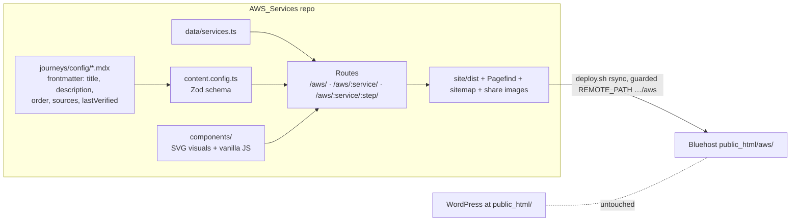

# Implementation Plan: AWS Learning Journeys, starting with AWS Config

## Problem Statement
Build a series of beginner learning journeys (one per AWS service) at studytrails.com/aws/. Each journey is a set of SEO-friendly, documentation-backed static pages with interactive visuals. Start with AWS Config. Deploy the same way as the Astro book: rsync to a Bluehost subfolder next to WordPress.

## Requirements
- URLs: `/aws/` (hub) → `/aws/config/` (overview) → `/aws/config/<step>/`. Prev/next navigation between steps, and progress saved in the browser.
- Steps: overview, what-is-aws-config, how-it-works, config-rules, remediation, conformance-packs-and-aggregators, config-vs-cloudtrail-vs-cloudwatch. Pricing, hands-on and quiz are out for now.
- Audience: beginners.
- Accuracy: check every fact against official AWS sources only (the Config Developer Guide, Config FAQ, CloudTrail User Guide and CloudWatch User Guide). Each page lists its sources and a "last verified" date.
- Visuals: custom SVG shapes in the book's colors, with small text labels for service names. No AWS icons.
- Examples: each page uses its own examples and works on its own for readers arriving from search.
- Extras (lean): GoatCounter analytics and a share image per page. No newsletter, reactions or audio.
- Reuse the book's stack and look, and deploy with an adapted deploy.sh.

## Background

### From the book (`~/projects/claude/AgenticAI/site`)
- Stack: Astro 5.18.2, @astrojs/sitemap 3.7.3, Pagefind 1.5.2, and satori/resvg for share images. Styling is plain CSS with violet/indigo tokens, and all client JS is vanilla.
- Reusable pieces: the sidebar with scroll-spy, the Pagefind search UI, the share-image generator, and the BaseLayout head pattern.
- `/agentic-ai-book` is hardcoded in about 15 places. The new site builds every URL from helper functions instead.
- The book has no tests, prev/next navigation, breadcrumbs or 404 page. These are new work.

### Bluehost and WordPress
- A real `/aws/` folder takes precedence over WordPress permalinks.
- Apache's built-in trailing-slash redirect (mod_dir) handles nested folders, so no custom rewrite rule is needed.
- A subfolder `.htaccess` stops WordPress from handling 404s there, so the site needs its own `404.html`.
- rsync `--delete` would wipe WordPress if `REMOTE_PATH` ever pointed at `public_html`. deploy.sh will refuse to run unless the path ends in `/aws`.
- `robots.txt` belongs to WordPress, so submit the sitemap in Search Console instead.

### Facts from the docs that shape the content
- Evaluation results are COMPLIANT, NON_COMPLIANT, ERROR and NOT_APPLICABLE. Insufficient data only appears as a footnote in the FAQ.
- Rules detect problems but don't prevent changes. Proactive mode doesn't block deployments.
- Custom rules are Lambda functions or Guard policies.
- Triggers are configuration changes, periodic (1, 3, 6, 12 or 24 hours) or hybrid.
- Recording is per Region, and can be continuous or daily.
- S3 gets a history file every 6 hours per resource type, snapshots arrive on request, and SNS carries the configuration stream.
- A configuration item has five parts. `relatedEvents` has been empty since version 1.3.
- Aggregators are read-only and free.
- Remediation uses SSM Automation documents, triggered manually or automatically.
- Conformance packs are YAML templates and can be deployed across an Organization.
- Config answers "What did my resource look like?" CloudTrail answers "Who made the API call?"
- AWS now calls it "Security Hub CSPM".

## Proposed Solution



### Repo layout
```
AWS_Services/
  deploy.sh, deploy.config.example, .gitignore, README.md (how to add a journey)
  assets/studytrails-logo.png        # copied from the book, used for share images
  docs/aws-config-journey-plan.md    # this plan
  journeys/config/*.mdx              # content you edit
  site/
    astro.config.mjs                 # site, base '/aws', trailingSlash 'always', format 'directory'
    src/content.config.ts  src/data/services.ts
    src/lib/{urls,journey,progress,og-card}.ts
    src/layouts/{BaseLayout,StepLayout}.astro
    src/components/{Sidebar,Search,Breadcrumbs,PrevNext,Sources,Callout,KeyTerms,Figure,Tabs,...visuals}
    src/pages/{index.astro, 404.astro, [service]/index.astro, [service]/[step].astro, og/...png.ts}
    public/.htaccess, favicons
    tests/ (vitest)  e2e/ (playwright)
```

### Key design decisions
- Content: MDX files. Components are passed in through `<Content components={...}>`, so content files need no imports.
  - The frontmatter schema only accepts `sources` URLs on `docs.aws.amazon.com` or `aws.amazon.com`.
  - Descriptions are limited to 160 characters.
- Visuals: SVG is rendered at build time, so all text is in the HTML. JavaScript only adds interactivity.
  - Every figure has a caption and a text description.
  - Controls work from the keyboard, and captions are announced to screen readers (aria-live).
  - Animations respect reduced-motion settings.
  - Compliance states always show text, not just color.
- SEO:
  - Every page gets a unique title and description, a canonical URL, OG/Twitter tags and a share image.
  - JSON-LD: TechArticle on steps, Course on the overview, and BreadcrumbList on all pages.
  - Also: a sitemap, semantic headings, a "Key terms" definition list, internal links and a visible "Last verified" date.
- Search: Pagefind indexes each article (`data-pagefind-body`) with a per-service filter.
- Progress: stored in localStorage under `st-aws:<service>`. A step is marked done when you reach the end of the article, and the sidebar shows "N of 6".
- Versions: pin exact versions to match the book's installed ones. New dependencies (MDX, vitest, Playwright, axe, astro check) are pinned at install time. Node comes from mise (Node 22).

### Page plan (examples per page, taken from the docs)

| Step | Target search phrase | Visuals | Example |
|---|---|---|---|
| Overview | AWS Config tutorial for beginners | Journey map with progress ticks | — |
| what-is-aws-config | What is AWS Config | Use-case tabs (the 4 scenarios from the docs), prerequisites diagram (S3, SNS, IAM role, resource types), feature map | Viewing the IAM policy a user had on a given date |
| how-it-works | How AWS Config works | Animated flow (change → recorder → CI → S3/SNS), CI anatomy explorer, history timeline with a continuous/daily toggle, advanced query example | Removing an egress rule from a security group, which records the SG and its instances |
| config-rules | AWS Config rules explained | Rule simulator, trigger timeline, "detect, don't prevent" callout | `encrypted-volumes` on an EBS volume |
| remediation | AWS Config remediation | Remediation flow with a manual/automatic toggle | A managed SSM document (name confirmed in the docs) |
| conformance-packs-and-aggregators | AWS Config conformance packs / aggregator | YAML ↔ rules bundle view, accounts × Regions aggregator map with read-only arrows | A central IT team working across accounts |
| config-vs-cloudtrail-vs-cloudwatch | AWS Config vs CloudTrail vs CloudWatch | "Which service answers this?" click-to-sort exercise and a comparison table | The "Production-DB" security group from the FAQ |

## Task Breakdown
Commit locally after each task using Conventional Commits. Never push.

### Task 1: Scaffold the project with base-path-safe URLs
- Objective: a working Astro build at `/aws/` in the book's style.
- Guidance:
  - `git init`, with a `.gitignore` for `deploy.config`, node_modules, dist, .astro and test output.
  - Create `site/` with pinned Astro, sitemap and MDX. Add the astro.config above, a tsconfig, and `astro check`.
  - Add `lib/urls.ts` with `withBase()` and `absUrl()`, built on `import.meta.env.BASE_URL` and `Astro.site`.
  - Port global.css and a cleaned-up BaseLayout with no hardcoded paths. Add favicons, a placeholder hub page and `404.astro`.
- Tests: vitest for the URL helpers (slashes, nested paths, absolute URLs). The build succeeds and `astro check` passes.
- Demo: `npm run dev` shows the `/aws/` hub in book styling. `npm run build` produces `dist/index.html` and `dist/404.html`.

### Task 2: Content model and journey routing
- Objective: every Config page exists and is linked in order.
- Guidance:
  - `content.config.ts` globs `../journeys/**/*.mdx` with a Zod schema (title, navTitle, description, order, summary, sources, lastVerified). If Vite blocks the path, fall back to `vite.server.fs.allow`.
  - Add a `services.ts` registry.
  - Add `lib/journey.ts` for ordered steps, prev/next, and duplicate-order checks.
  - Add two `[service]` routes and a StepLayout with breadcrumbs, PrevNext, a Sources section and "Last verified".
  - Add stub MDX for all 7 pages.
- Tests: unit tests for journey ordering, prev/next at both ends, and duplicate or missing order. Schema tests reject non-AWS source URLs and descriptions over 160 characters.
- Demo: click from `/aws/` to `/aws/config/`, through all 6 steps and back using prev/next and breadcrumbs.

### Task 3: Sidebar, search and progress
- Objective: sidebar navigation, working search and saved progress.
- Guidance:
  - Adapt the book's sidebar to show journey steps, the current step's outline with scroll-spy, and a mobile layout.
  - Wire Pagefind through `withBase`, using `data-pagefind-body` and the service filter.
  - `lib/progress.ts` holds pure read/write/merge functions. A small client script marks a step done at the end-of-article sentinel, and the sidebar shows a progress bar.
- Tests: unit tests for progress. Set up Playwright (installs Chromium) against `astro preview` to test navigation, progress surviving a reload, and a search for "configuration item" returning the right step.
- Demo: search from any page, complete some steps, reload, and progress is still there.

### Task 4: SEO layer and share images
- Objective: complete, validated metadata on every page.
- Guidance:
  - Head: title pattern, description, canonical, OG/Twitter tags with image dimensions, JSON-LD (TechArticle, Course, BreadcrumbList, and ItemList on the hub), and GoatCounter.
  - Port `og-card.ts` with text like "AWS Config · Beginner journey" and add a share-image endpoint for each page.
- Tests: a vitest check over dist confirms that:
  - Each page has one h1, a title and a description.
  - Each canonical is absolute and under `https://www.studytrails.com/aws/`.
  - Each og:image file exists.
  - The JSON-LD parses.
  - No `/agentic-ai-book` strings remain.
  - All internal links resolve.
  - The sitemap lists every page.
- Demo: view the page source, open the generated share PNGs, and read the sitemap.

### Task 5: Shared visual kit and journey map
- Objective: accessible building blocks for every step.
- Guidance:
  - Components: `Figure` (caption plus text description), `Callout` (tip / misconception / note), `KeyTerms`, and `Tabs` (all panels in the HTML).
  - A `Stepper` script with pure step logic, keyboard support, aria-live and reduced motion.
  - SVG primitives: a labeled service node, an arrow, and a compliance pill, with color tokens.
  - A `JourneyMap` on the overview with progress ticks.
- Tests: unit tests for the Stepper logic. Playwright covers Tabs and Stepper by keyboard and runs an axe scan of the overview. Full WCAG validation still needs manual testing with assistive technology.
- Demo: the overview shows an interactive journey map that reflects your progress.

### Tasks 6–11: one step page each (content and visuals)
These rules apply to every task in this group:
- Fetch every cited AWS page and check each claim against it.
- Fill in `sources` and `lastVerified`, and write the SEO title and description.
- Add a Key terms section and at least one callout.
- Unit-test any logic in the visuals.
- Playwright tests interactions and runs axe. With JS disabled, the core text must still be present.

- **Task 6: what-is-aws-config**
  - Visuals: use-case tabs, a prerequisites diagram, and a feature map that links forward to later steps.
  - Demo: a complete, readable first step.
- **Task 7: how-it-works**
  - Visuals: ConfigFlow, CIAnatomy, and HistoryTimeline with a continuous/daily toggle.
  - Also covers an advanced query example and the `relatedEvents` note.
  - Demo: step through the recording pipeline and compare a history recorded continuously vs daily.
- **Task 8: config-rules**
  - Visuals: RuleSimulator (its evaluation function is unit-tested, and each rule behaves as its docs page describes), TriggerTimeline, and the misconception callout.
  - Demo: run the simulator and watch the evaluation results change.
- **Task 9: remediation**
  - Visuals: RemediationFlow with a manual/automatic toggle, using an SSM document name confirmed in the docs.
  - Demo: follow a noncompliant resource back to COMPLIANT.
- **Task 10: conformance-packs-and-aggregators**
  - Visuals: ConformancePackBundle, and AggregatorMap with an Organization vs authorized-accounts toggle.
  - Demo: explore a pack's rules, then see accounts and Regions flow into one read-only view.
- **Task 11: config-vs-cloudtrail-vs-cloudwatch, plus final overview and hub copy**
  - Visuals: ServiceSorter (click-to-assign, with scoring unit-tested), a comparison table, and "where to go next".
  - Demo: the full journey is complete end to end.

### Task 12: Deploy pipeline and go-live
- Objective: a safe, repeatable deploy to studytrails.com/aws/.
- Guidance:
  - Adapt deploy.sh:
    - Update the header text.
    - Run the unit and SEO checks before uploading.
    - Refuse to run unless `REMOTE_PATH` ends in `/aws`.
  - Add `deploy.config.example` with the same keys as the book.
  - `public/.htaccess`:
    - `ErrorDocument 404 /aws/404.html`, and `Options -Indexes`.
    - Cache headers: HTML for 10 minutes, hashed `_astro` assets for 1 year (immutable), images for 30 days.
  - Add a README section on how to add a new service journey.
  - Run `./deploy.sh --build`. Run `--dry-run` once the user has created `deploy.config`.
  - Don't deploy live until the user explicitly confirms, since this touches the production site.
  - Smoke test with `curl -I`:
    - `/aws/` and `/aws/config/` load.
    - A URL without a trailing slash returns a 301.
    - A missing page returns the 404.
    - The WordPress home page still loads.
  - Manual steps: submit `https://www.studytrails.com/aws/sitemap-index.xml` in Search Console, and confirm there's no WordPress page with the slug "aws".
- Demo: the AWS Config journey is live at https://www.studytrails.com/aws/config/.
